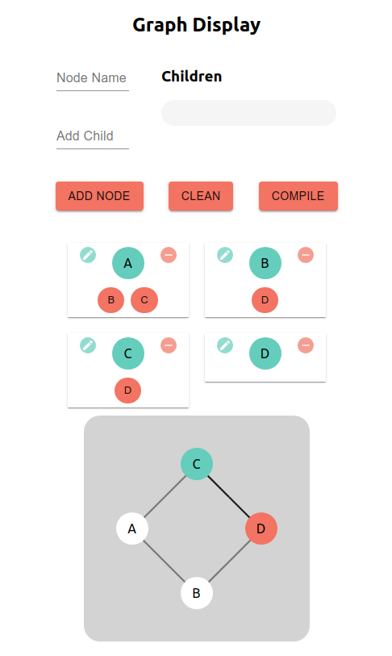

# Graph Positioning
Define nodes and edges positions of a cycle-less or undirected graph.
## Motivation
The main problem when drawing graphs is to position edges without trespassing nodes. To solve this problem and achieve an optimal solution was utilized A* algorithm and a JSON friendly api to allow easy drawing in front-end programs. 
## Requirements
The main project, _"structure"_ folder, has no requirement besides python 3.
## Examples  
### simple_example.py
Builds a small graph and find a edge path with _origin (1,0)_ and _target (3,4)_
### react_flask
React app using flask to handle communication between user interface and python program.

